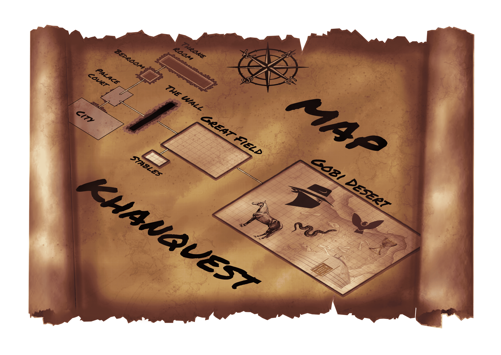

# Kazakh Invader bot
 A discord bot for discord friend groups.
 
 # How to run it
You first have to create an application in the Discord Developer portal and get a token from there. Put the token in the .env file.
 
<h4>Required scopes:</h4>
<ul>
 <li>bot</li>
 <li>messages.read</li>
 <li>applications.commands</li>
 </ul>
  
 <h6>You will need to create a redirect url as well. You can use: http://localhost:53134 </h6>

<h1> How to run this bot </h1>

<h3>If you want to use this bot for yourself you will have to run it yourself either locally or through a hosting service</h3>

To run this bot you will need to install the following libraries: 
<h6>  - test  -datetime  -table2ascii  -aiohttp  -emoji  -pyrandmeme  -requests  -discord  -discord.py  -dotenv  -asyncio  </h6>

<h3> With </h3> <code class = "language-html"> pip install library</code>  
from your console

  
<h3> You will need to make a few edits to the code for the bot to work fully in your server</h6>

<ol>
<li>theres a Trivia section where you can change the questions if you want</li>
<li>set server user IDs as variables instead of "user1" and "user2"</li>
<li>set the variable user1 to being the bot admin</li>
<li>You can add quotes users from your server said under the quote command instead of user 1 and user 2 with the default quotes</li>
<li>You can set the general and bot channels IDs in the on_ready function</li>
<li>Change the folder location in the variable KazakInvader_location</li>
</ol>

 
<h2> You can now run the bot with</h2>
<code class = "language-html"> python bot.py</code>
<h3>from your terminal</h3>
<h6>make sure you are located in the correct directory first</h6>

  
<h1>Khanquest</h1>
<h4>The bot includes a text-based game called Khanquest II: The forbidden Yurt</h4>
This game is the sequel to Khanquest: The Rise. You play as <b>Temujin</b>, commonly known as <em>Gengis Khan</em> after his succesfull Rise to power
  
<em>You are Genghis Khan, the Emperor of the Mongol Empire, on a quest to uncover the secrets of the forbidden Yurt. As the greatest conqueror of your time, you must navigate through treacherous terrain and outwit your enemies to find the ultimate prize: the Eagle of Life and the Horse of Power. Navigate between rooms to find new challenges and minigames such as Eagle Hunting, which will give you the tools required on your journey.<em>
 
  
 <h3>Map:</h3>

 
 <h1>Planning</h1>
  
  <h5>Khanquest creates a channel that only the player can see when the command is run. The game is then played through this channel</h5>
 Every time there is a message in that channel the bot checks to see if it is a possible command from the correct user for that channel's game then runs the correct action for that input if it is valid
   
 This had to be done as the bot needs to register actions and let the user play the game normally while the bot still processes other commands and games from other users.
 
   
 <h5>Khanquest movement uses a list that stores all rooms as a grid on an x and y axis, there is then another list that stores the player's current x position and y position</h5>
 Each room is then a class containing a string for the look command and the name of the room as well as if there is any special action in this room
  
 Each time there is movement between rooms the game checks if the user is in a room that contains a special action that has to be run
 
   
 
<h4> Gamedata and Active games with the channels they are running in, amongst other data is stored in sqlite tables in databases saved on the host PC </h4>
